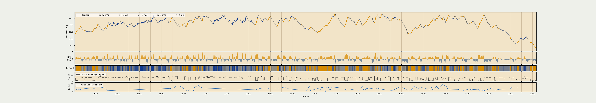

# flightstates — flight track in, one line of text out

Reads IGC tracks. Writes one text line per flight: the flight as a sequence
of segments. Two kinds, everything else is a number:

| Code | Segment | carries |
|---|---|---|
| `K` | circling | turn count, drift = **the wind**; a long climb is several pieces of ~4 turns, each with its own drift |
| `G` | straight | `w` = **vertical movement of the air** (m/s, own sink removed), airspeed, path |

The unit is the second, not the thermal. So the air that carries a pilot
*without* circling — the air that decides a cross-country flight — is in the
data, not lost between climbs. No classes: maps colour continuously from `w`.

`flightstates.py` runs on its own; needs `numpy`, `pandas`, `scipy`. No maps,
no weather, no network.

## The runs

Removing the glider's own sink from the vario needs a sink polar per glider
type. It is measured first and inspected before the segmenter runs. On a
big or foreign archive, measure a sample first and look at it:

```bash
pip install numpy pandas scipy

python3 polarmaker.py "flights/**/*.IGC" --part 1/10 --out probe.npz   # 1  sample
python3 polarmaker.py --join probe.npz --out probe.csv                 #    look at probe.csv + probe_stat.csv
python3 polarmaker.py "flights/**/*.IGC" --out polars.csv              # 2  the polar table
python3 flightstates.py --delta "flights/**/*.IGC" > states.txt        # 3  the segmented flights
```

On a small archive of your own, step 1 can be skipped. What the pieces mean:

* `"flights/**/*.IGC"` — replace `flights` with the folder holding your IGC
  files; `**` searches all subfolders. The quotes are required (the script
  expands the pattern itself; case of `.igc` doesn't matter). Several
  patterns may be given. Duplicate files (same name and size) are
  processed once.
* `--delta` — compact numbers (recommended); without it, plain numbers.
* `> states.txt` — the segmenter prints to standard output; `>` puts it in
  a file.
* `--polars FILE` (step 3) — which table to use; default: `polars.csv` next
  to the script. `--id TEXT` — what to write in the first field (default `P`).

`polars.csv` is one small table: per glider type, own sink at 25–65 km/h,
measured as the mode of the vario per band (the most common air on a glide
is near-still air). Values that measured air instead of glider — slow
flight spent in ridge lift does this — are discarded by physics and
stability checks (thresholds and their justification: header of
`polarmaker.py`). **No positions, no times, no pilots** — every line
readable by eye. Glider type comes from `HFGTY`; names are normalised but
digits are never touched. Per single flight the sink estimate scatters
0.21 m/s; per type at 50+ flights, ±0.03. Flights without a table row use
the `_general` row; the line marks it (`pol` field: `g` own row, `a`
general).

Next to the table, `polars_stat.csv` records **every band of every glider**
— kept or discarded, with the reason and a 90 % confidence interval from a
bootstrap over flights. Which glider types to trust (or blacklist) can be
decided later from this file and the `.npz` sample dumps alone, without
touching the IGC files again.

Steps 2 and 3 parallelise with `--part k/n`. Polar parts write `.npz`;
`--join "teil*.npz"` builds the table, identical to a single pass.
Segmenter parts are plain text; `cat` them. Memory stays small: per flight
only a 12 KB histogram is kept, never the raw seconds.

Since 1.2 the `.npz` keeps three histograms per flight instead of one: all
seconds (`h`, what the table is built from — unchanged), quiet seconds
(`q`: steady vario, std over 61 s below 0.35 m/s, no circling within
120 s, not right after a bar change — still air does not fluctuate, and
the level of the vario is never looked at, only its steadiness) and the
30 s after a bar change (`a`: airspeed, 15-s mean, changed by 10 km/h
within 30 s). The table and the whisker file do not use `q` and `a`; they
are there to check the one assumption behind the mode — that the most
common air on a glide is near-still — where it is weakest, at the fast
end. On the example archive they agree: Zeolite 2 GT at 60 km/h, all
seconds −1.84, quiet −1.79, right after a bar change −1.94.

## Running it for someone else

If you hold an archive and someone asks you to compress it for them, the
steps above are all there is to do, and **four files** come out:

| | |
|---|---|
| `polars.csv` | one small table — one line per glider type |
| `polars_stat.csv` | the statistics behind it: every band of every glider, confidence interval, kept or discarded with reason |
| `polars.npz` | the raw per-flight histograms behind the statistics — pure counts |
| `states.txt` | one line per flight; with `--delta` and `xz -6` about 440 bytes per flying hour |

Send all four — the recipient needs the statistics to judge, and if need
be override, every polar decision; the header of `states.txt` records the
SHA1 of the `polars.csv` that was used, so lines and table can be checked
to match. Nothing else should be sent: the IGC files stay where they are. The text files are readable by eye before they leave
the house — no pilot names, and in the polar files no positions or times at
all; `polars.npz` holds nothing but count tables per glider type. The
glider type is the only thing carried over from the IGC header; it is what
the sink polar is fitted per, and without it every flight falls back to the
`_general` row.

## The output line

```
# flightstates 2.0 polars=polars.csv sha1=a48b1d37a814      <- file header, once
id;glider;pol;yyyymmdd;SEG|SEG|...;END

G (straight):   G,t,h,lat,lon,w,v,z
K (circling):   K,t,h,lat,lon,turns,drift_kmh,drift_from_deg
END:              t,h,lat,lon
```

`t,h,lat,lon` are second of day (UTC), altitude MSL and position at the
segment's **beginning**; the end of one segment is the beginning of the next.
`w` = vertical air movement in m/s, own sink removed. `v` = true airspeed
km/h (mean over the seconds). `z` = flown path over chord, in percent.
With `v` and the height difference, a sink polar can be re-derived from the
lines alone. `pol` records where the own-sink curve came from: `g` glider's
row, `a` `_general`, `n` none (constant −1.11).

**The first field is yours.** Default is the letter `P`; `--id TEXT` sets it.
An anonymised pilot key would make technique-over-the-years studies possible —
an offer, not a request; nothing needs the field.

`--delta` writes every number as difference to the previous — same content,
short numbers; `read_line()` / `read_line_delta()` in `flightstates.py` turn
a line back into segments.

```
P;NIVIUK Artik 6;g;20230522;k27039,1920,4637603,802630,0.6,,|R45,-3,-160,42,-0.2|…
```

## How it decides

Per second: circling if the summed heading change over a centred 20 s window
exceeds 60° (checked against hand-marked flights: 94.7 % agreement). Wind
from the circling drift (≥1.5 turns, ≥30 s, endpoints trimmed, ≤40 km/h);
a long climb is cut into pieces of about 4 full turns, each a wind sample
of its own height — measured on 1628 flights, the drift changes by
2.2 km/h per 100 m of climb in the median, seven times the noise, so one
mean per climb would throw that profile away. Straight stretches are cut on the
**air-corrected height** (height minus accumulated own sink at the flown
airspeed) and the ground plan — joint Douglas-Peucker, 30 m height, 60 m
position. Boundaries are pure geometry; no label enters the cutting.

All thresholds are constants at the top of `flightstates.py`:

| | | |
|---|---|---|
| sampling | 1 Hz | turn window/threshold | 20 s / 60° |
| height smoothing | Savitzky-Golay 15 s | wind sample | ≥1.5 turns, ≥30 s, ≤40 km/h |
| tolerances | 30 m height, 60 m position | wind smoothing | 600 s |
| minimum run | 20 s | recorder gaps >60 s | longest stretch kept |
| circling piece | ~4 full turns | | |
| coordinates | 5 decimals (~1 m) | altitude spikes >500 m | dropped |

## Check

```bash
python3 verify.py flight.IGC --out check.png
python3 chart.py  flight.IGC --out plate.png
```

`verify.py` draws the flight twice — from the IGC, and from the text line
alone — and prints the errors. Typical: height mean 9 m (90 % under 22 m),
position mean 32 m (90 % under 68 m), every `w` and all time shares identical.

`chart.py` draws one flight as a plate like the picture below. Options:
`--raw` adds the untouched trace on top, `--language en`, `--title TEXT`.
Both scripts expect `polars.csv` and `flightstates.py` beside them.



## Size and time

Measured on 1 488 alpine flights (7 720 h): **8.8 bytes per segment, 440 bytes
per flying hour** (`--delta`, `xz -6`); steps 2 and 3 together ~35 ms per flying
hour per core. A world archive of ~950 000 flights: **about 2 GB compressed,
about one core-day** — an afternoon on eight cores. Lines are independent;
process the file line by line.

```bash
for k in 1 2 3 4; do
  python3 flightstates.py --delta --part=$k/4 "flights/**/*.IGC" > part$k.txt &
done
wait; cat part*.txt | xz -6 > states.txt.xz
```

## Files

| | |
|---|---|
| `flightstates.py` | the segmenter (step 3), self-contained |
| `polarmaker.py` | sink polar per glider type, with statistics (steps 1–2) |
| `polars.csv`, `polars_stat.csv`, `polars.npz` | example output of steps 1–2 (one archive, 1628 flights); replace with your own |
| `example_line.txt`, `example_line_delta.txt` | one flight of that archive as a text line, both forms |
| `example_day.png`, `example_verify.png` | the same flight through `chart.py` and `verify.py` |
| `verify.py`, `chart.py` | check picture, day plate |

Notes: barometric height when plausible, else GPS; date from `HFDTE`, times
UTC; flights without valid B records are skipped and reported on stderr. The
wind method is taken unchanged from a tested implementation. The polar is
measured in near-still air; it contains harness and trim, and is not a
manufacturer polar.

Jörg Korner, 2026. Free to use.
